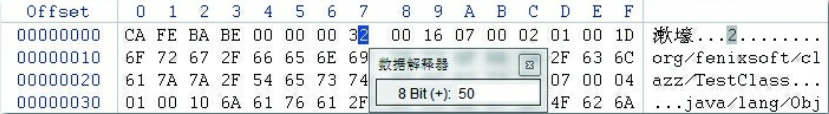

本篇分析java文件编译后的class文件 储存了那些东西

# 16进制class文件储存的内容

查看class文件 打开文件 vim xx.class ，然后输入:%!xxd 就是以16进制显示class文件了，内容如下

## 魔数与版本号

魔数：前四位代表是该文件的类型，用来识别身份。如图片文件的JPG,JPEG等

版本号：第5，6位代表次版本号，第7，8位代表主版本号  JDK8是52 JDK9是53

## 常量池

17种常量池

## 访问标志

在常量池结束之后，紧接着的2个字节代表访问标志（access_flags），这个标志用于识别一些类或 者接口层次的访问信息，包括：这个Class是类还是接口；是否定义为public类型；是否定义为abstract 类型；如果是类的话，是否被声明为final；等等。具体的标志位以及标志的含义见表

## 类索引、父类索引与接口索引集合

类索引（this_class）和父类索引（super_class）都是一个u2类型的数据，而接口索引集合 （interfaces）是一组u2类型的数据的集合，Class文件中由这三项数据来确定该类型的继承关系。类索 引用于确定这个类的全限定名，父类索引用于确定这个类的父类的全限定名。由于Java语言不允许多 重继承，所以父类索引只有一个，除了java.lang.Object之外，所有的Java类都有父类，因此除了 java.lang.Object外，所有Java类的父类索引都不为0。接口索引集合就用来描述这个类实现了哪些接 口，这些被实现的接口将按implements关键字（如果这个Class文件表示的是一个接口，则应当是 extends关键字）后的接口顺序从左到右排列在接口索引集合中

## 字段表集合 方法表  

字段表（field_info）用于描述接口或者类中声明的变量。Java语言中的“字段”（Field）包括类级变 量以及实例级变量，但不包括在方法内部声明的局部变量。读者可以回忆一下在Java语言中描述一个 字段可以包含哪些信息。字段可以包括的修饰符有字段的作用域（public、private、protected修饰 符）、是实例变量还是类变量（static修饰符）、可变性（final）、并发可见性（volatile修饰符，是否 强制从主内存读写）、可否被序列化（transient修饰符）、字段数据类型（基本类型、对象、数组）、 字段名称。上述这些信息中，各个修饰符都是布尔值，要么有某个修饰符，要么没有，很适合使用标 志位来表示。而字段叫做什么名字、字段被定义为什么数据类型，这些都是无法固定的，只能引用常 量池中的常量来描述。

    