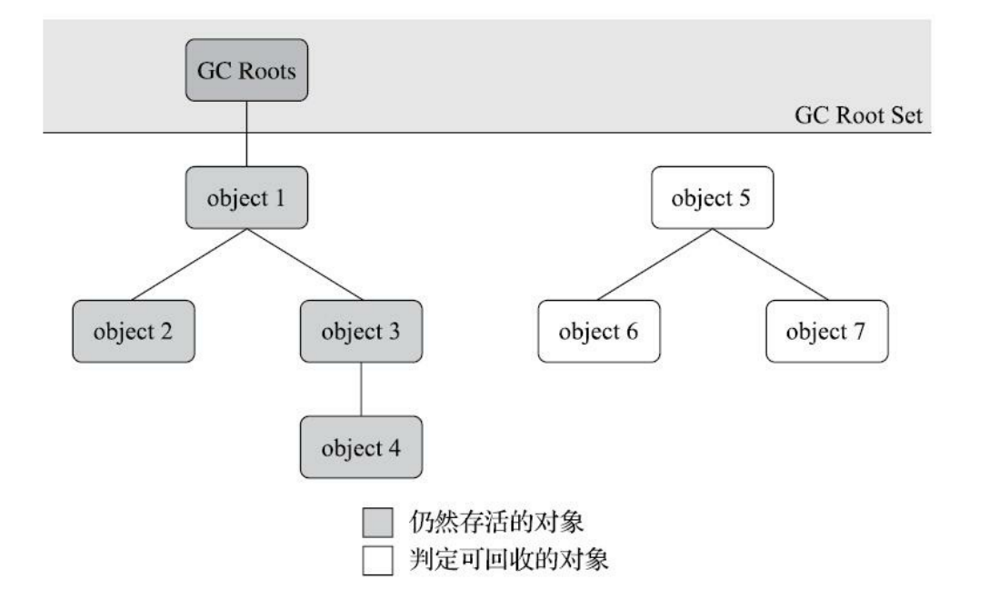
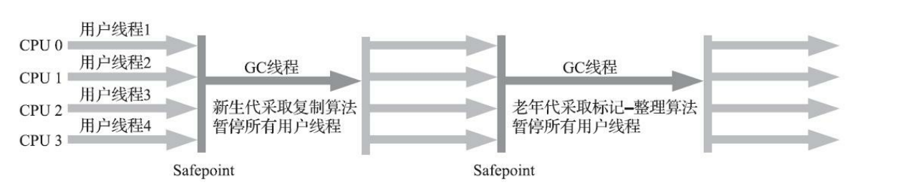
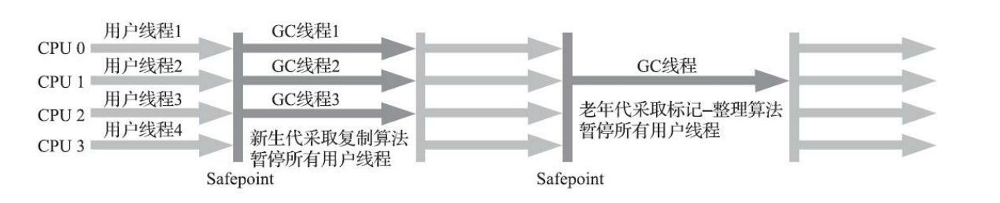
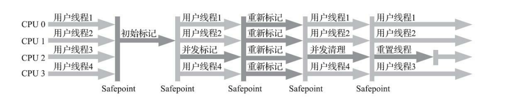
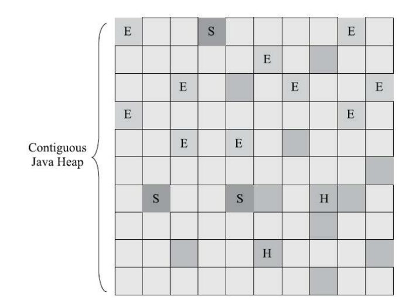

## 对象存活判断

### 引用计数法
引用计数法：在对象中添加一个计数器，每有一个引用就+1，引用失效就-1，为0就不可用

缺点：两个无意义的对象互相引用则不会被GC回收
```java
obja.obj = objb;
objb.obj = obja;
```    

### 可达性分析

可达性分析算法：通过一系列以`GCRoot`为根对象作为起始节点，如果某个对象无法通过引用找到根节点，则对象视为不能使用

java采用可达性分析判断对象存活，但是不可达对象并不是一定会被回收，如果没有重写对象的finalize()方法，或者finalize()方法被执行过一次，才会被回收




## 引用的分类

强引用： 垃圾不会回收
软引用： jvm内存满了才会回收
弱引用： 活到下次垃圾回收之前
//todo
虚引用： 无法对对象造成影响

## 分代收集理论

现在的垃圾回收机制建立在分代收集理论之上

分代收集理论：

弱分代假说：绝大多数对象是朝生夕灭的

强分代假说：经历多次回收的对象难易消灭

跨代引用假说：跨代引用占比很小（在新生代建立一个记忆集，把老年代分为几个区域，存放老年代需要收集的区域）

根据这个理论主要吧内存分为新生代与老年代，新生代中的对象存活时间短，多次GC后的对象会转移到老年代

收集区域分部分收集与整堆收集

部分收集（Partial GC）
- 新生代收集（Minor GC/Young GC）
- 老年代收集（Major GC/Old GC） 目前只有CMSS收集器会有单独收集老年代
- 混合收集（Mixed GC）目前只有G1会收集新生代与部分老年代

整堆收集（Full GC）整个java堆和方法区的收集

方法区也会发生GC，主要收集废弃的常量(如`java`)和不再使用的类型（卸载某些不使用的类）

判定一个常量是否“废弃”还是相对简单，而要判定一个类型是否属于“不再被使用的类”的条件就 比较苛刻了。需要同时满足下面三个条件： 

- 该类所有的实例都已经被回收，也就是Java堆中不存在该类及其任何派生子类的实例。 ·
- 加载该类的类加载器已经被回收，这个条件除非是经过精心设计的可替换类加载器的场景，如 OSGi、JSP的重加载等，否则通常是很难达成的
- 该类对应的java.lang.Class对象没有在任何地方被引用，无法在任何地方通过反射访问该类的方法

> tips 并不是满足了上述条件就一定会被回收，需要虚拟机开启
>
>在大量使用反射、动态代理、CGLib等字节码框架，动态生成JSP以及OSGi这类频繁自定义类加载 器的场景中，通常都需要Java虚拟机具备类型卸载的能力，以保证不会对方法区造成过大的内存压力。
## 垃圾回收算法

### 标记清除算法  mark-sweep

原理：标记需要回收的对象，集中清除

缺点：
- 如果标记对象过多，标记和清除两个过程效率低
- 会产生大量空间碎片，大对象无法分配

### 标记复制算法 mark-copy

一般是对新生代清理算法

原理：将新生代分为三个区域Eden，From Survivor区，To Survivor区，大小比为8:1:1，每次使用Eden和一个Survivor区，对存活对象进行标记，然后复制到另外一个Survivor区，清除Eden和Survivor区

缺点：
- 对象存活率较高时，需要频繁复制
- 虽然保证了空间利用率达到90%（Eden+Survivor），但是存活对象超过10%，则需要借助老年代的空间

### 标记整理算法 mark-compact

一般是对老年代清理算法

原理：将存活对象集中移动到内存一个区域，然后清除余下的空间

缺点：
- 不仅要标记对象还要进行对象地址的移动，效率低但是适合对象存活时间较长的老年代


## 垃圾回收器

### Serial/SerialOld收集器

Serial收集器 : 采用标记复制算法 回收新生代

SerialOld收集器 : 采用标记整理算法 回收老年代

特点：单线程  回收垃圾时会中断其他工作线程（stop-the-world）




### ParNew收集器

ParNew收集器 : 采用标记复制算法 回收新生代 

特点：是Serial收集器的多线程版本

因为是多线程执行，所以在多CPU下，ParNew效果通常会比Serial好。但如果是单CPU则会因为线程的切换，性能反而更差。


### Parallel  Scavenge/ Parallel Old

PS与ParNew类似，侧重点不同，PS关注GC的吞吐量，停顿时间是由吞吐量和新生代空间为代价换来的
响应时间越短，说明回收的区域越小，越频繁

PS会提供一个自适应的调节策略（GC Ergonomics），不需要手动设置新生或老年代的参数

Parallel Old就是PS的老年代版本采用标记整理算法

### CMS (concurrent mark sweep) 

cms收集器：基于标记清除算法，追求最短回收停顿时间

流程分为四个步骤：
- 初始标记：耗时最短，单线程标记`GCRoot`能直接关联的对象，需要stop-the-world
- 并发标记：耗时最长，垃圾回收线程可以与用户线程并行执行，这是和parallel等并行回收器不同的地方。
- 重新标记：因用户程序继续运作而导致标记产生变动的那一部分对象的标记记录
- 并发清除：与用户线程一起并行清除



特点：

- 由于采用标记清除算法，内存碎片多
- 对cpu运算能力敏感，虽然不会造成应用停顿，和用户线程一起抢占资源 。默认开启回收线程数为 (CPU核心 + 3 / 4),所以在核心少的机器里会降低用户程序的运算速度
- 无法处理"浮动垃圾"（并行标记或清除时产生的新的对象），只能留到下一次垃圾回收时清理。所以要保留一定空间来储存这个对象，如果空间不足就会出现一次病发失败，冻结所有线程并启动serial old来回收老年代

### G1 (garbage first)

特点：
- 全堆收集器，不分新生代或是老年代。
- 把堆分为若干块大小相等的`region`,每个`region`有自己的分代属性，而且不需要连续存放
- 可预测GC回收的停顿时间，通过判断每次回收几个`region`实现
- 有一个特殊分类`Humongous`存放超过`region`一半大小的大对象
- 优先回收收益高的对象（对象能释放的空间和回收耗时的比值），在后台维护一个各个`region`回收对象的优先列表
- 为了维护跨代引用，会在每个`region`内维护一个记忆集，会占用更多的内存




### ZGC

