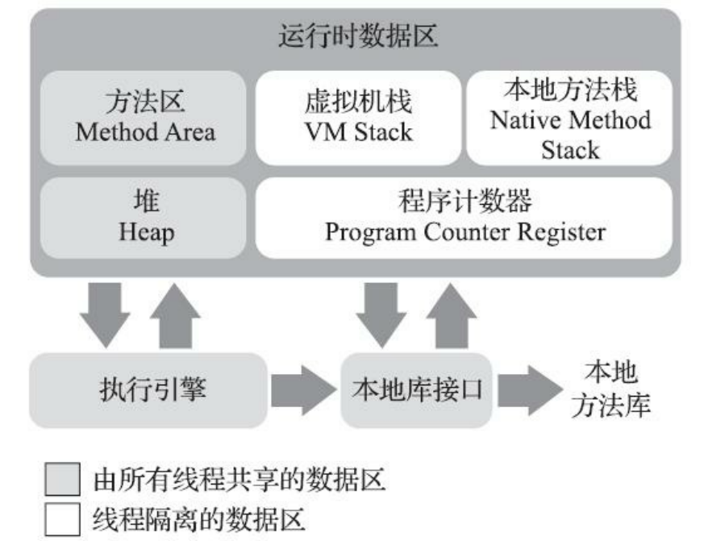

## jvm运行时内存区域

### **程序计数器**   

占用较小空间，是当前线程执行的字节码行号指示器，每个线程拥有独立的程序计数器，线程私有，唯一一个不会OOM的区域
> 字节码解释器工作时就是通过改变这个计数器的值来选取下一条需要执行的字节码指令，它是程序控制流的指示器，分支、循环、跳转、异常处 理、线程恢复等基础功能都需要依赖这个计数器来完成。
> 如果执行 java 方法，记录的是字节码指令的地址
> 如果执行 native 方法，计数器的值为空  

###**java虚拟机栈**

线程私有，生命周期与线程相同

虚拟机栈描述的是Java方法执行的线程内存模型：每个方法被执行的时候，Java虚拟机都会同步创建一个栈帧（Stack Frame）用于存储局部变量表、操作数栈、动态连接、方法出口等信息。每一个方法被调用直至执行完毕的过程，就对应着一个栈帧在虚拟机栈中从入栈到出栈的过程

> 局部变量表储存了编译期可知的java基本数据类型，对象引用和returnAdress类型（指向一条字节码指令的地址）  

线程请求的栈深度大于允许的深度 会报StackOverFlow
### **本地方法栈**

与虚拟机栈作用类似，一个是为java方法字节码服务，一个是本地native方法服务，但是hotspot中两者合二为一不是分开的

### **java堆**

虚拟机管理的内存中最大的一块区域，线程共享，绝大部分对象的实例都是在堆上分配

java堆是垃圾回收器管理的内存区域，也叫GC堆

java堆在内存上可以不连续，但是一些特殊结构比如数组就会连续存储

java堆可以实现固定大小的，也可以扩展 -Xmx -Xms，如果java堆无法分配实例且不能再扩展就会报出OOM

#### 对象的内存布局

一个对象可以分为三部分，对象头，实例数据，对齐填充

对象头分为 ： 
- mark word ：对象运行时的数据，hashcode，锁标志位，GC分代年龄，偏向时间戳
- 类型指针 ：指向类型的元数据，虚拟机通过这个指针确定是哪个类

#### 对象的访问定位

句柄访问：栈直接访问句柄池的的地址，句柄池会在堆中开辟一块空间，存储到对象实例数据的指针和对象类型数据的指针
直接指针访问：栈直接访问对象的实例数据，在实例数据中存放类型数据的指针

句柄好处是栈中只需要句柄池的指针，对象地址变化时只需要修改句柄池内的指针

直接访问：减少一次指针寻址 hotspot采用这个方式

## 方法区

用于储存类的信息，常量，静态变量，即时编译器编译后的代码缓存，是jvm的规范并不是连续的内存空间

JDK7以前用永久代实现方法区，JDK7后其中的字符串常量池移到堆中，JDK8以后废弃永久代并将剩余内容移到本地内存的元空间中

## 运行时常量池

运行时常量池（Runtime Constant Pool）是方法区的一部分。Class文件中除了有类的版本、字 段、方法、接口等描述信息外，还有一项信息是常量池表（Constant Pool Table），用于存放编译期生 成的各种字面量与符号引用，这部分内容将在类加载后存放到方法区的运行时常量池中

- 提到常量池，一般指的是方法区中的静态/运行时常量池。
- 字符串池/字符串常量池/字符串对象池/String Pool/String Table 都可以看作一个东西。
- 包装类对象池技术和 JVM 的常量池没有任何关系。

> 包装类对象池技术如 Integer 是在java类中代码实现的并不是像 字符串常量池一样是jvm层面的

引用博客

[jvm常量池](https://blog.csdn.net/Xu_JL1997/article/details/89150026?utm_medium=distribute.pc_relevant.none-task-blog-BlogCommendFromMachineLearnPai2-2.nonecase&depth_1-utm_source=distribute.pc_relevant.none-task-blog-BlogCommendFromMachineLearnPai2-2.nonecase)