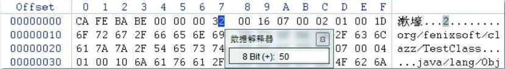

类加载机制是jvm中重要部分，其中双亲委派也是面试中的高频点

# 类加载机制


一个类型从被加载到虚拟机内存中开始，到卸载出内存为止，它的整个生命周期将会经历加载 （Loading）、验证（Verification）、准备（Preparation）、解析（Resolution）、初始化 （Initialization）、使用（Using）和卸载（Unloading）七个阶段，其中验证、准备、解析三个部分统称 为连接（Linking）

## 加载

- 通过类的全限定名获取定义此类的二进制字节流
- 将字节流中的静态储存结构变为方法区的运行时结构
- 在堆中创建一个代表此类的java.lang.class对象，作为方法区这个类各种数据的外部接口

第一步的而二进制流可以通过多种渠道获取，压缩包，网络，运行时动态生成，数据库，加密文件等，只要是满足要求的二进制流即可

## 验证

- 验证加载进来的二进制流是否合规范，之前我们看class文件的16进制，开头是类型，版本号，常量池等

- 验证字节码
- 验证元数据
- 验证符号引用

## 准备

为类中的变量分配内存，和给一些字段设置初始值
```java

public static int  v = 1;   //  分配为0  1会在初始化时分配

public static final int  v = 1;  //  直接分配为1

```


## 解析

解析阶段是Java虚拟机将常量池内的符号引用替换为直接引用的过程

如某个类继承java.lang.object,他只是个符号不是实际地址，所以直接引用要找到真实地址并建立引用关系

## 初始化

初始化阶段就是执行类构造器<clinit>()方法的过程。<clinit>()并不是程序员在Java代码中直接编写 的方法，它是Javac编译器的自动生成物，

·<clinit>()方法是由编译器自动收集类中的所有类变量的赋值动作和静态语句块（static{}块）中的 语句合并产生的，编译器收集的顺序是由语句在源文件中出现的顺序决定的，静态语句块中只能访问 到定义在静态语句块之前的变量，定义在它之后的变量，在前面的静态语句块可以赋值，但是不能访问

1）遇到new、getstatic、putstatic或invokestatic这四条字节码指令时，如果类型没有进行过初始 化，则需要先触发其初始化阶段。能够生成这四条指令的典型Java代码场景有： ·使用new关键字实例化对象的时候。 ·读取或设置一个类型的静态字段（被final修饰、已在编译期把结果放入常量池的静态字段除外） 的时候。·调用一个类型的静态方法的时候。 

2）使用java.lang.reflect包的方法对类型进行反射调用的时候，如果类型没有进行过初始化，则需 要先触发其初始化。

3）当初始化类的时候，如果发现其父类还没有进行过初始化，则需要先触发其父类的初始化。 

4）当虚拟机启动时，用户需要指定一个要执行的主类（包含main()方法的那个类），虚拟机会先 初始化这个主类。 

5）当使用JDK 7新加入的动态语言支持时，如果一个java.lang.invoke.MethodHandle实例最后的解 析结果为REF_getStatic、REF_putStatic、REF_invokeStatic、REF_newInvokeSpecial四种类型的方法句 柄，并且这个方法句柄对应的类没有进行过初始化，则需要先触发其初始化。 

6）当一个接口中定义了JDK 8新加入的默认方法（被default关键字修饰的接口方法）时，如果有 这个接口的实现类发生了初始化，那该接口要在其之前被初始化。

> 多线程初始化一个类时，只有一个线程可以初始化，其他会被阻塞并且当初始化完成时，不会重复初始化

> 静态代码块只能初始化一次 并且会覆盖静态变量的赋值,如果静态变量在静态代码块后面，则只能赋值不能读取


