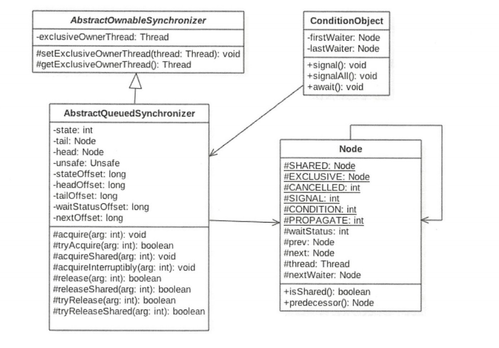

# LockSupport 
JDK 中的 rt.jar 里面的 `LockSupport` 是个工具类，它的主要作用是挂起和唤醒线程
该工具类是创建锁和其他同步类的基础。AQS阻塞基于LockSupport的方法

1.*park(Thread thread) 方法*：挂起一个线程直到调用这个线程`unpark(Thread thread)`方法或者调用当前线程的`interrupt()`方法

> 注意的一点是 阻塞的线程调用interrupt()被中断后并不会抛出 InterruptedException 异常
```java
//实现一个lock锁
public class LockSupportTest {
    private final AtomicBoolean locked = new AtomicBoolean(false) ;
    private final Queue<Thread> waiters = new ConcurrentLinkedQueue<Thread>();
    public void lock () {
        boolean wasinterrupted = false ;
        Thread current= Thread.currentThread();
        waiters.add(current);
        while (waiters.peek() !=current || !locked.compareAndSet (false , true)) {
            LockSupport.park(this);
            // 因为中断 interrupt 也可以唤醒 park 阻塞，所以在这里用 wasinterrupted 进行标记是否因中断而引起的唤醒，并清除线程自身的中断标记，然后继续循环 park 进行阻塞
            if (Thread.interrupted() ) {
                wasinterrupted = true ;
            }
            }
        waiters.remove();
        //如果当前线程中断过  重新设置在中断标记
        //这一步的原因是lock内不想通过中断来释放锁，但是lock锁住的业务程序会需要中断的状态
        //eg. 
        // current.interrupt(); 中断了
        // lock();   //这里就不会中断
        // current.sleep(1)   //需要中断的业务代码中就会中断
        // unlock();
        if (wasinterrupted){
            current.interrupt();
        }
    }

    public void unlock() {
        locked.set(false);
        LockSupport.unpark(waiters.peek());
    }
}


```

2.*unpark(Thread thread) 方法*：唤醒一个`unpark`阻塞的线程

> 如果先调用unpark在调用park，线程就会直接返回不会阻塞，因为unpark已经提前拿到park的执行许可


# AQS 
AbstractQueuedSynchronizer抽象同步队列简称AQS，实现同步器的基本组件，juc包下的锁的底层基于AQS



AQS是一个FIFO的双向队列，其内部通过节点`head`和`tail`记录队首和队尾元素，队列元素的类型为`Node`，其中`Node`中的`thread`变量用来存放进入AQS队列里面的线程

其中的状态值`state`代表当前资源的锁定状态，分为独占和共享两种操作方法

独占方式：一个资源只能被一个线程锁定，可重入 如 `ReentrantLock`

共享方式：一个资源可以同时被几个线程锁定  如 `ReentrantReadWriteLock`读写锁，读时可被几个线程锁定，但不能同时写操作要等所有读锁释放完毕


## AQS重要方法

### 独占获取与释放资源

- 1.首先执行tryAcquire获取一次锁(利用CAS修改state的值)，失败的线程继续运行
- 2.利用CAS进行入队操作
- 3.判断当前线程的前一个节点是否是队头，如果是则有获取线程的资格，进行锁争夺，成功则设为头结点
- 4.判断失败的线程是否进行阻塞，如果前一个节点是SIGNAL状态，就会被阻塞
- 5.使用 LockSupport.park()进行阻塞
- 6 7. LockSupport.park() 有可能会被线程中断 interrupt 唤醒，而不是使用unpark唤醒，所以被唤醒时记录并清除中断标记，并再次进行轮询阻塞 
- 8.线程获取锁成功时，如果中断标记为 true 则进行 selfInterrupt

> 为什么要进行 selfInterrupt 呢？  
> 因为AQS对中断操作不敏感，线程调用了 interrupt 也不会抛出异常，以 ReentrantLock 为例 ，抢占加锁的期间不会抛出中断异常，但是不代表这个中断信号就消失了，
> 在业务代码中如果遇到了能中断的函数如 wait（） sleep（）等也会抛出异常，所以 selfInterrupt 的作用就是重新添加中断标记

```java
public abstract class AbstractQueuedSynchronizer
    extends AbstractOwnableSynchronizer
    implements java.io.Serializable {

    public final void acquire(int arg) {
        //1.
        if (!tryAcquire(arg) &&
        //2.
            acquireQueued(addWaiter(Node.EXCLUSIVE), arg))
        //8.
            selfInterrupt();
    }

    //失败的线程在队列中进行轮询
    final boolean acquireQueued(final Node node, int arg) {
        boolean failed = true;
        try {
            boolean interrupted = false;
            for (;;) {
                final Node p = node.predecessor();
                //3.
                if (p == head && tryAcquire(arg)) {
                    setHead(node);
                    p.next = null; // help GC
                    failed = false;
                    return interrupted;
                }
                //4.
                if (shouldParkAfterFailedAcquire(p, node) &&
                //5.
                    parkAndCheckInterrupt())
                    interrupted = true;
            }
        } finally {
            if (failed)
                cancelAcquire(node);
        }
    }
    //入队操作
    private Node addWaiter(Node mode) {
        Node node = new Node(Thread.currentThread(), mode);
        // Try the fast path of enq; backup to full enq on failure
        Node pred = tail;
        if (pred != null) {
            node.prev = pred;
            if (compareAndSetTail(pred, node)) {
                pred.next = node;
                return node;
            }
        }
        enq(node);
        return node;
    }

   private static boolean shouldParkAfterFailedAcquire(Node pred, Node node) {
        int ws = pred.waitStatus;
        if (ws == Node.SIGNAL)
            /*
             * This node has already set status asking a release
             * to signal it, so it can safely park.
             */
            return true;
        if (ws > 0) {
            /*
             * Predecessor was cancelled. Skip over predecessors and
             * indicate retry.
             */
            do {
                node.prev = pred = pred.prev;
            } while (pred.waitStatus > 0);
            pred.next = node;
        } else {
            /*
             * waitStatus must be 0 or PROPAGATE.  Indicate that we
             * need a signal, but don't park yet.  Caller will need to
             * retry to make sure it cannot acquire before parking.
             */
            compareAndSetWaitStatus(pred, ws, Node.SIGNAL);
        }
        return false;
    }

    private final boolean parkAndCheckInterrupt() {
        //6.
        LockSupport.park(this);
        //7.
        return Thread.interrupted();
    }

}
```
tryAcquire（获取资源）的方法需要自己实现，ReentrantLock和ReentrantReadWriteLock进行不同的实现，这种模式就是模板设计模式

