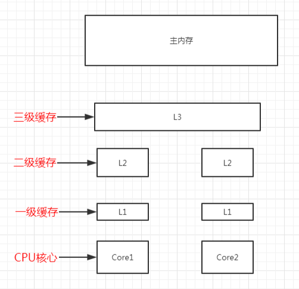
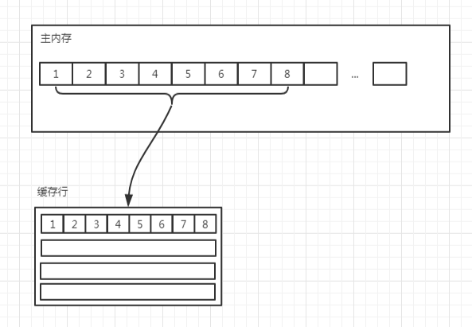
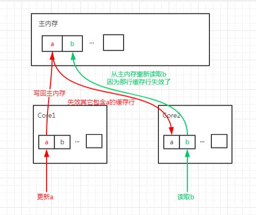

伪共享问题指的是CPU自己的内存共享问题，介绍伪共享先要了解两个概念 *cpu的内存架构* 与*cpu内存的缓存行*

## cpu的内存架构



分为多级 L1，L2，L3，与主内存，越靠近 CPU 的缓存越快也越小。

加入我们要取一个变量 p 的值进行运算，cpu会先在离核心最近的L1中进行取值，如果为空继续下一层直到主内存，并将值层层缓存到每一级

## cpu的缓存行

缓存是由缓存行组成的，通常是 64 字节（常用处理器的缓存行是 64 字节的，比较旧的处理器缓存行是 32 字节），并且它有效地引用主内存中的一块地址。

一个 Java 的 long 类型是 8 字节，因此在一个缓存行中可以存 8 个 long 类型的变量。



这种结构会带来什么好处呢？

比如我有一个数组，地址在内存中是连续得，所以在缓存行中也是连续的，访问速度很快。但是链表就享受不到了

这种结构会带来什么坏处呢？

比如内存中地址相邻的2个变量a和b，被两个线程同时缓存到2个cpu内存中，当线程1修改a的值时，会进行2步操作，刷新主内存a的值,并使其他包含a的缓存行失效。
所以当线程2想要获取b时，发现线程2的cpu缓存行失效了，就要从主内存中获取，我们知道主内存相比cpu缓存是很慢的，所以线程2躺枪



## 示例

```java
public class FalseSharingTest {

    public static void main(String[] args) throws InterruptedException {
        testPointer(new Pointer());
    }

    private static void testPointer(Pointer pointer) throws InterruptedException {
        long start = System.currentTimeMillis();
        Thread t1 = new Thread(() -> {
            for (int i = 0; i < 100000000; i++) {
                pointer.x++;
            }
        });

        Thread t2 = new Thread(() -> {
            for (int i = 0; i < 100000000; i++) {
                pointer.y++;
            }
        });

        t1.start();
        t2.start();
        t1.join();
        t2.join();

        System.out.println(System.currentTimeMillis() - start);
        System.out.println(pointer);
    }
}

class Pointer {
    volatile long x;
    volatile long y;
}
```
可以看到，x 和 y 完全没有任何关系，但是更新 x 的时候会把其它包含 x 的缓存行失效，同时也就失效了 y，运行这段程序输出的时间为`3764ms`

## 避免伪共享

一个缓存行是 64 个字节，一个 long 类型是 8 个字节

方法1 ： 添加7个变量凑满一个缓存行

```java
class Pointer {
    volatile long x;
    long p1, p2, p3, p4, p5, p6, p7;
    volatile long y;
}
```
再次运行时间 ： `643ms`
方法2 ： 创建一个自定义的类 原理也是凑满一个缓存行
```java

class Pointer {
    MyLong x = new MyLong();
    MyLong y = new MyLong();
}

class MyLong {
    volatile long value;
    long p1, p2, p3, p4, p5, p6, p7;
}
```

再次运行时间 ： `624ms`
方法3 ：使用 @sun.misc.Contended 注解（java8）

```java
@sun.misc.Contended
class MyLong {
    volatile long value;
}
```
再次运行时间 ： `603ms`

默认使用这个注解是无效的，需要在JVM启动参数加上`XX:-RestrictContended`才会生效，，再次运行程序发现时间是`718ms`。

注意，以上三种方式中的前两种是通过加字段的形式实现的，加的字段又没有地方使用，可能会被jvm优化掉，所以建议使用第三种方式。

## 总结
（1）CPU具有多级缓存，越接近CPU的缓存越小也越快；

（2）CPU缓存中的数据是以缓存行为单位处理的；

（3）CPU缓存行能带来免费加载数据的好处，所以处理数组性能非常高；

（4）CPU缓存行也带来了弊端，多线程处理不相干的变量时会相互影响，也就是伪共享；

（5）避免伪共享的主要思路就是让不相干的变量不要出现在同一个缓存行中；

（6）一是每两个变量之间加七个 long 类型；

（7）二是创建自己的 long 类型，而不是用原生的；

（8）三是使用 java8 提供的注解；