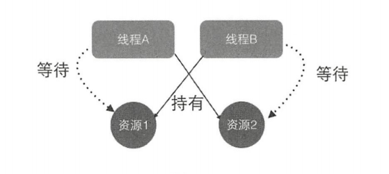

# 死锁问题

## 什么是线程死锁

死锁是指两个或两个以上的线程在执行过程中，因争夺资源而造成的互相等待的现象，
在无外力作用的情况下，这些线程会 直相互等待而无法继续运行下去

出现死锁的四个条件：

- 互斥  （同一个锁只能被一个线程获取，其他线程进行阻塞）
- 请求并持有  （线程获取了A锁，有请求B锁，但同时不放开A锁）
- 不可剥夺  （线程获取到锁后，不可被剥夺）
- 环路等待  （线程A请求线程B持有的锁，B请求A）

## 如何避免线程死锁

破坏其中一个条件即可

互斥，不可剥夺条件不可破坏  因为是锁的特性

所以只能从请求并持有与环路等待破坏

造成死锁的原因其实和申请资源的顺序有很大关系 保证资源申请的有序性原则就可

- 避免多次锁定    减少在A中锁定B,再在B中锁定C的操作
- 具有相同的加锁顺序    两个线程都是A->B->C 的上锁顺序
- 使用定时锁  //todo