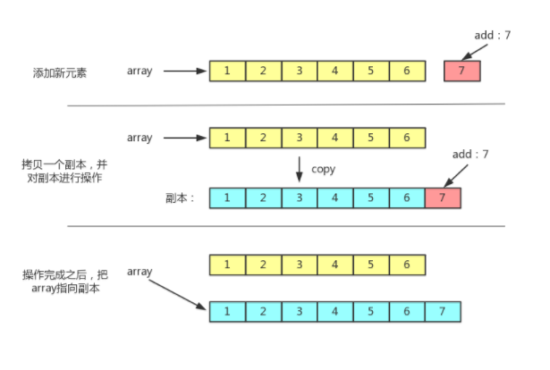

`CopyOnWriteArrayList`是`ArrayList`的一个线程安全的变体，其中所有可变操作（`add`、`set` 等等）都是通过对底层数组进行一次新的复制来实现的。

`CopyOnWriteArrayList`是一个写时复制的容器，采用了读写分离的思想。通俗点来讲，在对容器进行写操作时，不直接修改当前容器，而是先对当前容器进行拷贝得到一个副本，然后对副本进行写操作，最后再将原容器的引用指向拷贝出来的副本。这样做的好处就是可以对容器进行并发读而不用进行加锁。


## add操作

```java
public boolean add(E e) {
    // 可重入锁
    final ReentrantLock lock = this.lock;
    // 获取锁
    lock.lock();
    try {
        // 元素数组
        Object[] elements = getArray();
        // 数组长度
        int len = elements.length;
        // 复制数组
        Object[] newElements = Arrays.copyOf(elements, len + 1);
        // 将要添加的元素放到副本数组的末尾去
        newElements[len] = e;
        // 设置数组
        setArray(newElements);
        return true;
    } finally {
        // 释放锁
        lock.unlock();
    }
}
```

基本原理很简单，就是对当前数组加锁，内部复制一个新数组，处理完毕，修改引用即可，达到最终一致的效果。

## get操作

```java
public E get(int index) {
    return get(getArray(), index);
}

private E get(Object[] a, int index) {
    return (E) a[index];
}
```

>通过写时复制的方式，`CopyOnWriteArrayList` 的 `get` 方法不用加锁也可以保证线程安全，所以 `CopyOnWriteArrayList` 并发读的效率是非常高的，它是直接通过数组下标获取元素的。

## 特点
我认为`CopyOnWriteArrayList`这个并发组件，其实反映的是两个十分重要的分布式理念：

（1）读写分离

>我们读取`CopyOnWriteArrayList`的时候读取的是`CopyOnWriteArrayList`中的`Object[] array`，但是修改的时候，操作的是一个新的`Object[] array`，读和写操作的不是同一个对象，这就是读写分离。这种技术数据库用的非常多，在高并发下为了缓解数据库的压力，即使做了缓存也要对数据库做读写分离，读的时候使用读库，写的时候使用写库，然后读库、写库之间进行一定的同步，这样就避免同一个库上读、写的IO操作太多

（2）数据一致性

>对`CopyOnWriteArrayList`来说，线程1读取集合里面的数据，未必是最新的数据。因为线程2、线程3、线程4四个线程都修改了`CopyOnWriteArrayList`里面的数据，但是线程1拿到的还是最老的那个`Object[] array`，新添加进去的数据并没有，所以线程1读取的内容未必准确。不过这些数据虽然对于线程1是不一致的，但是对于之后的线程一定是一致的，它们拿到的`Object[] array`一定是三个线程都操作完毕之后的`Object array[]`，这就是最终一致。最终一致对于分布式系统也非常重要，它通过容忍一定时间的数据不一致，提升整个分布式系统的可用性与分区容错性。当然，最终一致并不是任何场景都适用的，像火车站售票这种系统用户对于数据的实时性要求非常非常高，就必须做成强一致性的。

（3）修改成本高

> 每一次添加数据，都需要`copy`数组进行复制 ，每次还只扩容1个大小

（4）线程绝对安全

> `CopyOnWriteArrayList`是线程绝对安全的
>
> `Vector`是相对的线程安全而不是绝对的线程安全，它只能够保证增、删、改、查的单个操作一定是原子的，不会被打断，但是如果组合起来用，并不能保证线程安全性。
>
> 我的理解是由于读是拷贝一个新的数组 不会受到其他线程的干扰 所以是绝对安全的  