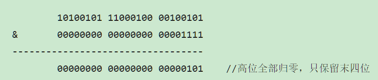
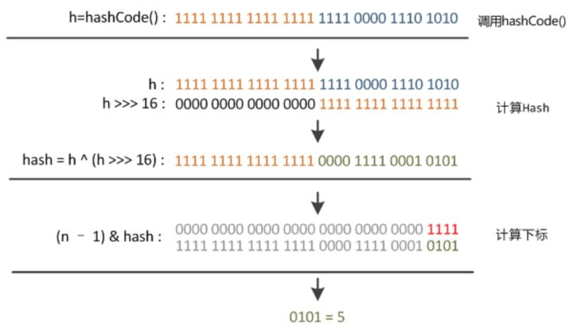

HashMap基本算是集合中的必修课了  各个知识点都要理解掌握

# HashMap

## 基本性质

1.JDK7以前使用数组+链表形式 JDK8以后采用数组+链表+红黑树解决Hash冲突之后链表过长的问题

2.线程不安全，不能保证put()和get()的是同一数据。JDK7由于采用头插法容易造成循环链表问题 JDK8采取尾部插入有覆盖数据的问题 保证线程安全可采用concurrentHashMap或采用可以用 Collections类的synchronizedMap的方法

3.默认容量为16，负载因子为0.75，每次扩容2倍

## 属性
```java
//默认的初始容量为16
static final int DEFAULT_INITIAL_CAPACITY = 1 << 4; // aka 16
//最大的容量上限为2^30
static final int MAXIMUM_CAPACITY = 1 << 30;
//默认的负载因子为0.75
static final float DEFAULT_LOAD_FACTOR = 0.75f;
//变成树型结构的临界值为8
static final int TREEIFY_THRESHOLD = 8;
//恢复链式结构的临界值为6
static final int UNTREEIFY_THRESHOLD = 6;
/**
 * 哈希表的最小树形化容量
 * 当哈希表中的容量大于这个值时，表中的桶才能进行树形化
 * 否则桶内元素太多时会扩容，而不是树形化
 * 为了避免进行扩容、树形化选择的冲突，这个值不能小于 4 * TREEIFY_THRESHOLD
 */
static final int MIN_TREEIFY_CAPACITY = 64;
//哈希表
transient Node<K,V>[] table;
//哈希表中键值对的个数
transient int size;
//哈希表被修改的次数
transient int modCount;
//它是通过capacity*load factor计算出来的，当size到达这个值时，就会进行扩容操作
int threshold;
//负载因子
final float loadFactor;
```
- 思考点1：为什么容量一定是2的n次方

​     	HashMap最大的特点就是根据hash值来快速定位桶（数组）中元素，所以怎么根据hash值散列在桶中的位置就很重要了。假设桶的数量为length个,key 的 hash 值对 length 取余，但是取模运算的消耗很大在计算机中不如位运算，所以在HashMap中key 在数组中的 index = hashCode(key) & length-1，当 length 的值为2的n次方时，等价于对length取余.

以初始长度16为例，16-1=15
2进制表示是00000000 00000000 00001111
和某散列值做“与”操作如下，结果就是截取了最低的四位值



这样做的缺点就是当length值很小时，高位值并没有参与影响到 & 运算，增加了hash碰撞的概率	

但是在JDK8中HashMap并没有直接用Hashcode进行运算，而是又进行了一次hash，优化了高位运算的算法，通过hashCode()的高16位异或(^)低16位，使高位也可以影响index的值


```java
static final int hash(Object key) {   //jdk1.8 & jdk1.7
     int h;
     // h = key.hashCode() 为第一步 取hashCode值
     // h ^ (h >>> 16)  为第二步 高位参与运算
     return (key == null) ? 0 : (h = key.hashCode()) ^ (h >>> 16);
}
```



- 思考点2

