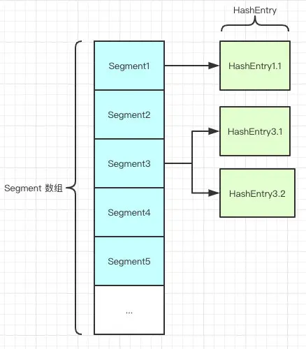

在并发场景下 推荐使用`concurrenthashmap`，但是`JDK7` 和`JDK8`的实现原理不用，面试时着重讲两者的对比与原理

# 一 . JDK7 实现

## 结构

`ConcurrentHashMap` 的内部细分了若干个小的 `HashMap` ，称之为段（ `SEGMENT` ）。 `ConcurrentHashMap` 是一个 `Segment` 数组，`Segment` 通过继承 `ReentrantLock` 来进行加锁，所以每次需要加锁的操作锁住的是一个 `segment` ，这样只要保证每个 `Segment` 是线程安全的，也就实现了全局的线程安全。

ConcurrentHashMap 采用了**分段锁**技术，其中 Segment 继承于 ReentrantLock。

不会像 HashTable 那样不管是 put 还是 get 操作都需要做同步处理，理论上 ConcurrentHashMap 支持 CurrencyLevel (Segment 数组数量)的线程并发。

每当一个线程占用锁访问一个 Segment 时，不会影响到其他的 Segment。

就是说如果容量大小是16他的并发度就是16，可以同时允许16个线程操作16个Segment而且还是线程安全的。



`Segment` 是 `ConcurrentHashMap` 的一个内部类，主要的组成如下：

```
static final class Segment<K,V> extends ReentrantLock implements Serializable {    
    private static final long serialVersionUID = 2249069246763182397L;    
    // 和 HashMap 中的 HashEntry 作用一样，真正存放数据的桶    
    transient volatile HashEntry<K,V>[] table;    
    transient int count;    
    // 快速失败（fail—fast）   
    transient int modCount;        
    // 大小    
    transient int threshold;        
    // 负载因子    
    final float loadFactor;
}
```


## get方法

`ConcurrentHashMap` 的 `get` 方法是非常高效的，因为**整个过程都不需要加锁**。

只需要将 `Key` 通过 `Hash` 之后定位到具体的 `Segment` ，再通过一次 `Hash` 定位到具体的元素上。由于 `HashEntry` 中的 `value` 属性是用 `volatile` 关键词修饰的，保证了内存可见性，所以每次获取时都是最新值.

内部`hashentry`类 ：

```
static final class HashEntry<K,V> {
    final int hash;
    final K key;
    volatile V value;
    volatile HashEntry<K,V> next;

    HashEntry(int hash, K key, V value, HashEntry<K,V> next) {
        this.hash = hash;
        this.key = key;
        this.value = value;
        this.next = next;
    }
}
```

## put方法

- 先找到`Segment` 
- 尝试自旋获取锁。如果重试的次数达到了 `MAX_SCAN_RETRIES` 则改为阻塞锁获取，保证能获取成功。
- 通过当前 Segment 中的 table 通过 key 的 hashcode 定位到 HashEntry


## 二. JDK8 实现

其中抛弃了原有的 Segment 分段锁，而采用了 `CAS + synchronized` 来保证并发安全性。

跟`HashMap`很像，也把之前的`HashEntry`改成了`Node`，但是作用不变，把`value`和`next`采用了`volatile`去修饰，保证了可见性


## put操作

- 根据 key 计算出 hashcode 。

- 判断是否需要进行初始化。

- 即为当前 key 定位出的 Node，如果为空表示当前位置可以写入数据，利用 CAS 尝试写入，失败则自旋保证成功。

- 如果当前位置的 `hashcode == MOVED == -1`,则需要进行扩容。

- 如果都不满足，则利用 synchronized 锁写入数据。

- 如果数量大于 `TREEIFY_THRESHOLD` 则要转换为红黑树。

```java
    final V putVal(K key, V value, boolean onlyIfAbsent) {
        if (key == null || value == null) throw new NullPointerException();
        int hash = spread(key.hashCode());
        int binCount = 0;
        for (Node<K,V>[] tab = table;;) {
            Node<K,V> f; int n, i, fh;
            // 1. 第一次put时 初始化数组
            if (tab == null || (n = tab.length) == 0)
                tab = initTable();
            // 2.即为当前 key 定位出的 Node，如果为空表示当前位置可以写入数据，利用 CAS 尝试写入，失败则自旋保证成功。
            else if ((f = tabAt(tab, i = (n - 1) & hash)) == null) {
                if (casTabAt(tab, i, null,
                             new Node<K,V>(hash, key, value, null)))
                    break;                   // no lock when adding to empty bin
            }
            //3.如果当前位置的 hashcode == MOVED == -1,则需要进行扩容。
            else if ((fh = f.hash) == MOVED)
                tab = helpTransfer(tab, f);
            //4.如果都不满足，则利用 synchronized 锁写入数据
            else {
                V oldVal = null;
                synchronized (f) {
                    if (tabAt(tab, i) == f) {
                        if (fh >= 0) {
                            binCount = 1;
                            for (Node<K,V> e = f;; ++binCount) {
                                K ek;
                                if (e.hash == hash &&
                                    ((ek = e.key) == key ||
                                     (ek != null && key.equals(ek)))) {
                                    oldVal = e.val;
                                    if (!onlyIfAbsent)
                                        e.val = value;
                                    break;
                                }
                                Node<K,V> pred = e;
                                if ((e = e.next) == null) {
                                    pred.next = new Node<K,V>(hash, key,
                                                              value, null);
                                    break;
                                }
                            }
                        }
                        else if (f instanceof TreeBin) {
                            Node<K,V> p;
                            binCount = 2;
                            if ((p = ((TreeBin<K,V>)f).putTreeVal(hash, key,
                                                           value)) != null) {
                                oldVal = p.val;
                                if (!onlyIfAbsent)
                                    p.val = value;
                            }
                        }
                    }
                }
                if (binCount != 0) {
                    // 5.如果数量大于 TREEIFY_THRESHOLD 则要转换为红黑树。
                    if (binCount >= TREEIFY_THRESHOLD)
                        treeifyBin(tab, i);
                    if (oldVal != null)
                        return oldVal;
                    break;
                }
            }
        }
        addCount(1L, binCount);
        return null;
    }
    }
```


