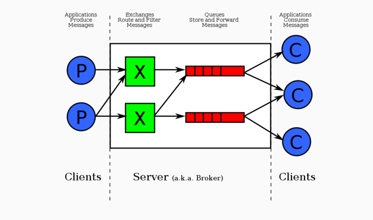

## 为什么要使用消息队列？

三个优势：异步 解耦 削峰

## RabbitMQ架构

Exchange:交换机 指定消息根据什么规则路由到哪个队列

Queue：消息的载体 一个消息可以路由到多个队列 

Binding：绑定 把Exchange和Queue绑定起来

Routing Key: 路由关键字

Vhost：虚拟主机代表一个用户 一个Broke（Server）有多个Vhost 用作不同用户的权限分力



## 四种 Exchege 交换机

- 默认模式（Defult-Direct）

**Exchege只绑定给一个队列**

消息采用循环分发模式（Round-Robin）平均分给消费者

如果有A B两个消费者，并且产生10条消息

A获得第 1 3 5 7 9 条消息

B获得第 2 4 6 8 10 条消息

- Fanout模式
- Topic模式

## 生产者的消息丢失

在 RabbitMQ 中，默认情况下，Producer 发送消息的方法，只保证将消息写入到 TCP Socket 中成功，并不保证消息发送到 RabbitMQ Broker 成功，并且持久化消息到磁盘成功。


## 消费者的消费丢失

在 RabbitMQ 中，Consumer 有两种消息确认的方式：

- 方式一，自动确认。
- 方式二，手动确认。

对于自动确认的方式，RabbitMQ Broker 只要将消息写入到 TCP Socket 中成功，就认为该消息投递成功，而无需 Consumer 手动确认。

对于手动确认的方式，RabbitMQ Broker 将消息发送给 Consumer 之后，由 Consumer 手动确认之后，才任务消息投递成功。

实际场景下，因为自动确认存在可能丢失消息的情况，所以在对可靠性有要求的场景下，我们基本采用手动确认。当然，如果允许消息有一定的丢失，对性能有更高的产经下，我们可以考虑采用自动确认。

 
## 消息持久化

创建交换机时，设置durable=true
```java
public class RabbitConfig02 {
        // 创建 Direct Exchange
        @Bean
        public DirectExchange demo01Exchange() {
            return new DirectExchange(Demo01Message.EXCHANGE,
                    true,  // durable: 是否持久化
                    false);  // exclusive: 是否排它
        }
}
```
创建queue时，设置durable=true
## 消息顺序消费

保证一个队列一个消费者就可以

## 消息并发消费

## 消息重复消费

在redis或jvm 记录每条消息的id值
