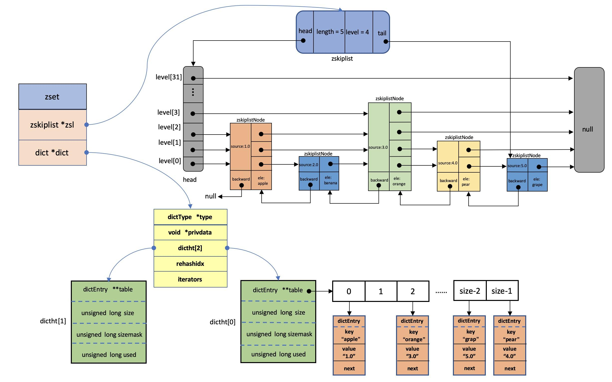

# 基础
## redis为什么这么快

c语言编写，基于内存的单进程单线程的KV数据库，单机可达10wQPS

- 完全基于内存，绝大部分请求是纯粹的内存操作，非常快速
- Redis中的数据结构是专门优化过的
- 采用单线程避免线程切换带来的开销，也不用加锁解锁，不会产生死锁问题
- **使用多路I/O复用模型，非阻塞IO**  //todo
- 使用底层模型不同，它们之间底层实现方式以及与客户端之间通信的应用协议不一样，Redis直接自己构建了VM 机制 ，因为一般的系统调用系统函数的话，会浪费一定的时间去移动和请求；

# 数据类型
主要有
- 字符串 String
- 列表List
- 字典Hash
- 集合Set
- 有序集合 SortedSet

高级用法有 
- HyperLogLog
- 地理Geo
- 位图Bitmap

##  String

redis是基于C语言写的，但是没有用c底层的string结构，而是创建了一个SDS（动态字符串）的类型

特点：

1.有一个实际占用的字段

2.预分配大小
```c
struct sdshdr{
//sdshdr5，sdshdr8，sdshdr16，sdshdr32，sdshdr64 
 int len; //实际占用内存  1bits
 int alloc/free;  //剩余空间 1bits
 char buf[]; //字符数组
}


struct RedisObject {
    int4 type; // 4bits
    int4 encoding; // 4bits
    int24 lru; // 24bits
    int32 refcount; // 4bytes
    void *ptr; // 8bytes，64-bit system
} robj;
```

比C的优势在于
- 可以常数时间O（1）获取字符串长度，c的字符串不存长度信息所有需要遍历整串O（n）
- 减少缓冲区溢出（如果c分配的字符串空间不够大 会覆盖相邻内存区域的其他字符串 ）
- 减少修改字符串时的内存分配次数（1. 由于已经预分配空间扩展方便 1M一下扩容翻倍 以上扩容1M 2. 惰性删除机制  删除时不回收这些区域而是用free收集起来留着下次使用 SDS也提供了API用于手动删除）
- 二进制安全（空值或其他特殊字符都会原封不动保存 c认为取到空值就结束）
- 兼容部分C字符串函数 因为在数组最后额外加上了空字符串'\0''

存不同的数据 有不同的编码格式 可通过dubug  object key查看

redis object对象 + sdshdr 对象

- int `204阿里云:0>DEBUG OBJECT intint
       "Value at:0x7fbb468b2c30 refcount:1 encoding:int serializedlength:5 lru:3971107 lru_seconds_idle:19"`
- embstr 存储字节 <= 44  `204阿里云:0>DEBUG OBJECT embemb
                            "Value at:0x7fbb468b2c30 refcount:1 encoding:embsdr serializedlength:45 lru:3971107 lru_seconds_idle:19"`
- raw  存储字节 > 44    `204阿里云:0>DEBUG OBJECT intint
                        "Value at:0x7fbb468b2c30 refcount:1 encoding:raw serializedlength:46 lru:3971107 lru_seconds_idle:19"`

如果一个 embstr 对象进行 append 操作 就会直接变成raw格式

## list
底层快速链表（quicklist）结构

快速链表由多个压缩链表组成

## hash
字典 dict  底层类似hashmap

扩容时是渐进式hash

## zset
dict和跳跃链表skiplist
```
typedef struct zset {
    dict *dict;
    zskiplist *zsl;
} zset;
```

skiplist做范围查询的效率是比较高的，但是对于单值的查找效率明显还是不如dict的，所以Redis使用dict数据结构来实现快速的单指查找。就像我们查找一个key中成员的分数 zscore key members，这里如果使用跳表去查，需要挨个不遍历链表中的每个成员，直到匹配到你所需要找到的成员，这样查询的效率是非常低的。



