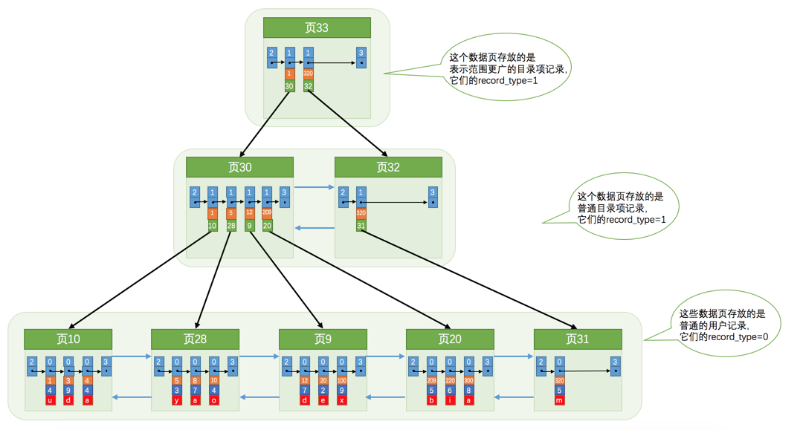
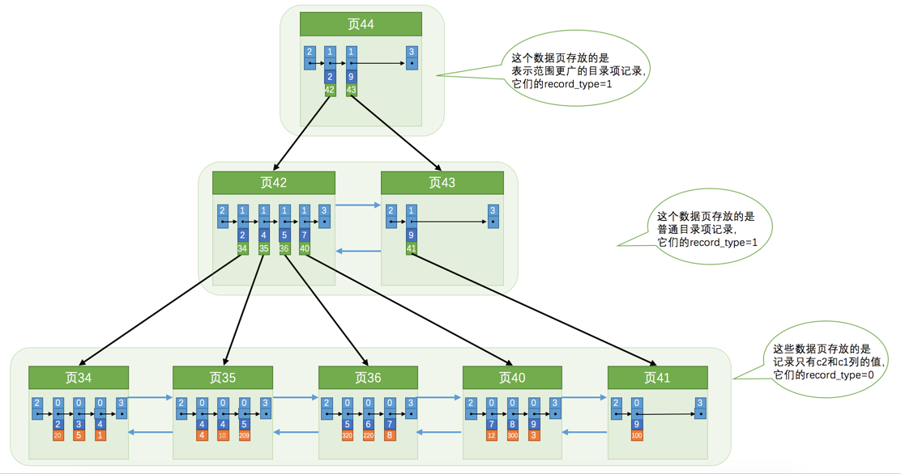
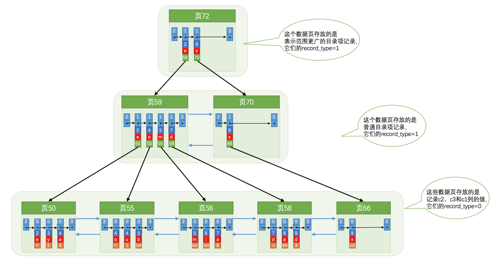

## 聚簇索引
聚簇索引： 根据主键建立的索引，叶子结点所有字段都在，innodb引擎默认创建  索引即数据

1.使用记录主键值的大小进行记录和页的排序，这包括三个方面的含义：

- 页内的记录是按照主键的大小顺序排成一个单向链表。

- 各个存放用户记录的页也是根据页中用户记录的主键大小顺序排成一个双向链表。

- 存放目录项记录的页分为不同的层次，在同一层次中的页也是根据页中目录项记录的主键大小顺序排成一个双向链表。

2.B+树的叶子节点存储的是完整的用户记录。

所谓完整的用户记录，就是指这个记录中存储了所有列的值（包括隐藏列）。

## 二级索引
二级索引：自己建立的索引

结构和聚簇索引类似，页内的记录按照构建索引的字段大小排序

## 联合索引索引

我们也可以同时以多个列的大小作为排序规则，也就是同时为多个列建立索引，比方说我们想让B+树按照c2和c3列的大小进行排序，这个包含两层含义：

- 先把各个记录和页按照c2列进行排序。
- 在记录的c2列相同的情况下，采用c3列进行排序

## 总结

- 每个索引都对应一棵B+树，B+树分为好多层，最下边一层是叶子节点，其余的是内节点。所有用户记录都存储在B+树的叶子节点，所有目录项记录都存储在内节点。

-（如果没有它会自动帮我们添加）建立聚簇索引，聚簇索引的叶子节点包含完整的用户记录。

-我们可以为自己感兴趣的列建立二级索引，二级索引的叶子节点包含的用户记录由索引列 + 主键组成，所以如果想通过二级索引来查找完整的用户记录的话，需要通过回表操作，也就是在通过二级索引找到主键值之后再到聚簇索引中查找完整的用户记录。

-B+树中每层节点都是按照索引列值从小到大的顺序排序而组成了双向链表，而且每个页内的记录（不论是用户记录还是目录项记录）都是按照索引列的值从小到大的顺序而形成了一个单链表。如果是联合索引的话，则页面和记录先按照联合索引前边的列排序，如果该列值相同，再按照联合索引后边的列排序。

-通过索引查找记录是从B+树的根节点开始，一层一层向下搜索。由于每个页面都按照索引列的值建立了Page Directory（页目录），所以在这些页面中的查找非常快。

# 索引优化

## 覆盖索引
覆盖索引是什么意思呢

比如我们有一个c1 c2 c3三个字段的表，并且建立了一个c1 c2的联合索引

我们要查找 `select c1,c2,c3 from table where c1 =1 and c2 =2`时会先查找联合索引，但是联合索引没有c3数据，这时要回表查询联合索引，影响效率

## 索引生效满足的条件

匹配左边的列

匹配列前缀

精确匹配某一列并范围匹配另外一列

用于排序

## 索引失效

or 如果查询的一部分没用索引 就会失效